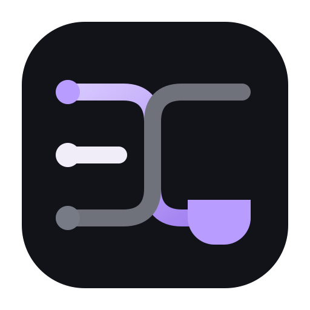
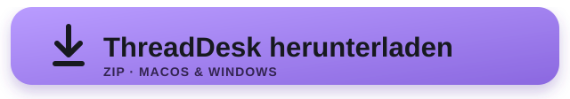

<strong>Ein Arbeitsplatz, der den Stand deiner KI-Projekte behält.</strong>

ThreadDesk speichert Threads, Notizen, Dateien und Snapshots. Es führt bewusst nichts aus.

### 👤 [Für Nutzer – einen Thread beginnen](#für-nutzer)

### 🛠️ [Für Entwickler – CLI, MCP und Aufbau](#für-entwickler)

---

## Für Nutzer

### Einfach erklärt

Beim Arbeiten mit KI springt man oft zwischen Ideen und Projekten. Später weiß niemand mehr genau, was entschieden wurde oder wo man aufgehört hat.

ThreadDesk merkt sich diesen Stand. Jeder Arbeitsbereich wird zu einem eigenen Thread.

> **Was ist der Stand?**

### Was du davon hast

- Jede Idee erhält ihren eigenen dauerhaften Kontext.
- Du kannst zwischen Projekten wechseln und später weitermachen.
- Notizen, Dateien und Snapshots bleiben beim Thread.
- Handoffs bereiten Arbeit für andere Werkzeuge vor.
- ThreadDesk startet niemals selbst einen Agenten.

### In drei Schritten

1. **Thread anlegen** – eine Idee oder Aufgabe benennen.
2. **Stand festhalten** – Notizen, Dateien und Status ergänzen.
3. **Weitergeben** – bei Bedarf ein Handoff für Gnom-Hub-V1 erzeugen.

### Heutiger Stand – ehrlich

| Bereich | Aktueller Stand |
|---|---|
| Threads | Anlegen, wechseln, archivieren und löschen |
| Kontext | Notizen, Dateien, History und Snapshots |
| Daten | JSON unter ~/.threaddesk; lokal |
| Oberfläche | CLI, lokale Tafel und optionale Weboberfläche |
| Übergaben | Vorbereitete Pakete für Grok und Gnom-Hub-V1 |
| Grenze | Kein Agentenstart und kein verstecktes Execute |

[Produktseite](https://threaddesk.netzwerkpunkt.de/)

---

## Einfach starten

### macOS

1. Oben auf **ThreadDesk herunterladen** klicken.
2. **ThreadDesk-macOS.dmg** laden und ThreadDesk nach „Programme“ ziehen — fertig. Die Ausgabe unterstützt Intel-Macs (i7) nativ.

Falls macOS den Doppelklick blockiert: Rechtsklick auf die Datei → **Öffnen**.

### Windows

1. Oben auf **ThreadDesk herunterladen** klicken.
2. **ThreadDesk-Windows.exe** laden und doppelklicken — fertig.

### Ein Terminal-Befehl

~~~sh
python3 start.py
~~~

Die Desktop-Downloads enthalten Python und alle benötigten Bestandteile. Für den Terminal-Befehl ist Python 3.9 oder neuer erforderlich.

Ein erster Thread in der Oberfläche:

Klicke auf „Neuer Thread“, gib deiner Idee einen Namen und speichere den ersten Stand.

---

## Für Entwickler

ThreadDesk ist eine lokale Control-Layer vor Gnom-Hub-V1. Die Grenze ist Teil des Produkts: Alle Übergaben werden vorbereitet, aber nicht automatisch gesendet oder ausgeführt.

### Wichtige Befehle

| Aufgabe | Befehl |
|---|---|
| Threads anzeigen | td list |
| Thread wechseln | td switch 1 |
| Status setzen | td status active |
| Snapshot speichern | td snap save "vor-umbau" |
| Prompt vorbereiten | td prompt |
| Handoff schreiben | td handoff |
| Lokale Oberfläche | td serve |
| MCP-Server | td mcp |
| Ausführung sperren | td gate freeze |
| Sprache umschalten | td --lang en list |

### Sprache

ThreadDesk spricht Deutsch und Englisch — Oberfläche und Kommandozeile.

| Weg | Beispiel |
|---|---|
| Einmalig | `td --lang en list` |
| Dauerhaft | `export THREADDESK_LANG=en` |
| Automatisch | aus `LC_ALL`, `LC_MESSAGES` oder `LANG` |
| Oberfläche | Schalter oben rechts, merkt sich die Wahl ein Jahr |

Ohne Angabe ist Deutsch die Voreinstellung. Die Gliederungswörter der
Kommandozeilenhilfe (`usage:`, `options:`) kommen aus Python selbst und
bleiben englisch.

Für die manuelle Entwicklerinstallation: `python3 -m pip install -e ".[dev,ui]"`. Daten liegen unter `~/.threaddesk/`.

### Wie dieses Projekt entsteht

**System Designer & Product Architect: Daniel Filipek (landjunge)**

Produktvision, gewünschtes Verhalten und Grenzen kommen von mir. KI unterstützt Implementierung, Tests und Dokumentation. Code und Verhalten müssen überprüfbar bleiben.

### Dokumentation

- [Benutzeroberfläche](docs/UI.md)
- [MCP](docs/MCP.md)
- [Grok-Handoff](docs/GROK.md)
- [TollGate-Grenze](docs/TOLLGATE.md)
- [Gnom-Hub-V1-Handoff](docs/GNOM.md)

---

**ThreadDesk beantwortet eine Frage: Was ist der Stand?**
Teil von [NetzwerkPunkt](https://netzwerkpunkt.de/) – eigenständig, local-first und ohne versteckte Ausführung.
