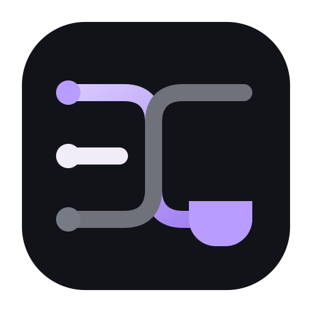

<strong>Ein Arbeitsplatz, der den Stand deiner KI-Projekte behält.</strong>

ThreadDesk speichert Threads, Notizen, Dateien und Snapshots. Externe Aktionen werden nicht versteckt ausgeführt. Ein optionaler lokaler Hausmeister kann innerhalb von ThreadDesk selbstständig arbeiten; seine Grenzen sind unten dokumentiert.

### 👤 [Für Nutzer – einen Thread beginnen](#für-nutzer)

### 🛠️ [Für Entwickler – CLI, MCP und Aufbau](#für-entwickler)

---

## Für Nutzer

### Einfach erklärt

Beim Arbeiten mit KI springt man oft zwischen Ideen und Projekten. Später weiß niemand mehr genau, was entschieden wurde oder wo man aufgehört hat.

ThreadDesk merkt sich diesen Stand. Jeder Arbeitsbereich wird zu einem eigenen Thread.

> **Was ist der Stand?**

### Was du davon hast

- Jede Idee erhält ihren eigenen dauerhaften Kontext.
- Du kannst zwischen Projekten wechseln und später weitermachen.
- Notizen, Dateien und Snapshots bleiben beim Thread.
- Handoffs bereiten Arbeit für andere Werkzeuge vor.
- ThreadDesk startet keine externen Agenten selbstständig. Der optionale lokale Hausmeister arbeitet ausschließlich lokal und innerhalb klarer Grenzen.

### In drei Schritten

1. **Thread anlegen** – eine Idee oder Aufgabe benennen.
2. **Stand festhalten** – Notizen, Dateien und Status ergänzen.
3. **Weitergeben** – bei Bedarf ein Handoff für Gnom-Hub-V1 erzeugen.

### Heutiger Stand – ehrlich

**Aktuelle Desktop-Ausgabe: [0.1.1rc1](https://github.com/landjunge/threaddesk/releases/tag/v0.1.1rc1)**,
veröffentlicht am 2. Oktober 2026. Der Download oben führt zu dieser geprüften
Ausgabe für Intel-Mac, Apple Silicon und Windows. [PR #63](https://github.com/landjunge/threaddesk/pull/63)
ist nach `main` übernommen. Die vollständige Testsuite hat 554 Prüfungen zweimal
ohne Fehler oder übersprungene Tests bestanden. Alle drei nativen Pakete haben
ihren Selbsttest bestanden; Quell-Commit und Prüfsummen wurden vor der
Veröffentlichung abgeglichen.

Die Ausgabe bleibt ein Release-Kandidat: Der erste Start auf deinem konkreten
Mac und die Qualität deines ausgewählten lokalen LLM müssen am jeweiligen Gerät
geprüft werden. macOS-Pakete sind ad-hoc signiert, nicht Apple-notarisiert.

| Bereich | Aktueller Stand |
|---|---|
| Threads | Anlegen, wechseln, archivieren und löschen |
| Kontext | Notizen, Dateien, History und Snapshots |
| Daten | Lokal: JSON, optional SQLite; getrennt vom Programmcode |
| Oberfläche | CLI, lokale Weboberfläche und Desktop-Pakete; UI-Bibliotheken werden lokal mitgeliefert |
| Übergaben | Vorbereitete Pakete für Grok und Gnom-Hub-V1 |
| Grenze | Keine versteckte externe Ausführung; lokaler Hausmeister nur innerhalb dokumentierter Grenzen |

### Gemeinsam arbeiten – ausdrücklich freigeben

Im Bereich **Raum** einen Namen eingeben und **Raum anlegen** wählen. Die Leitung
kann eine Einladung als **Mitglied** oder **Nur lesen** erzeugen. Auf der zweiten
Installation den Einladungscode und die lokale Adresse der ersten Installation
eintragen und **Koppeln** wählen. Die eingeblendeten Mitglieder zeigen die Kopplung.

Ein Whiteboard-Eintrag bleibt standardmäßig privat. Nur mit dem Freigabehäkchen
werden **der Eintrag einschließlich seiner Zuordnungen und der Thread-Titel**
für den ausgewählten Raum geteilt. Die separate private Thread-Notiz wird dadurch
nicht freigegeben. **Synchronisieren** stößt den Austausch bewusst an; es gibt
keine heimliche Komplettübertragung des Arbeitsbereichs.

**Nur lesen** darf empfangen, aber keine Raum-Einträge veröffentlichen. Eigene
neue Notizen bleiben privat. Ein Offline-Fehler bedeutet nicht, dass deine Daten
weg sind: Nach Rückkehr der Gegenstelle erneut synchronisieren. Bei einem
Inhaltskonflikt bleiben beide Fassungen erhalten. Wiederholter Sync darf keine
zusätzlichen Kopien erzeugen. Die Desktop-Adresse bleibt nach Neustarts gleich;
ist ihr Port belegt, erscheint ein Fehler statt einer Verbindung zu einer fremden App.

**Aktuelle Grenzen:** Die Abnahme prüft zwei getrennte lokale Serverprozesse, nicht
die Zusammenarbeit über einen Internet-Server. Die Oberfläche ist keine öffentlich
abgesicherte Server-Anwendung und darf nicht unverändert ins Internet gestellt werden.
Der lokale Austausch verwendet HTTP; er ist keine Ende-zu-Ende-Verschlüsselung.
Ein Sync-Paket ist auf 1.000.000 Bytes begrenzt. Zu große oder fehlerhafte Pakete
werden abgewiesen, nicht als erfolgreich abgeschnitten. Externer Server-Sync bleibt
ein eigener, noch abzunehmender Ausbau.

### Deine Daten sichern

Oben **Daten** öffnen und **Sicherung herunterladen** wählen. Die ZIP-Datei enthält
Threads, Notizen, Zwischenstände, Wissenskarte, Whiteboards und lokal gespeicherte
Übergaben für JSON oder SQLite. Verlinkte Dateien außerhalb von ThreadDesk bleiben
an ihrem ursprünglichen Ort und sind nicht Teil dieser Sicherung.

Zum Wiederherstellen die Sicherung auswählen, das Öffnen bestätigen und
**Sicherung öffnen** wählen. ThreadDesk prüft die Dateien und öffnet einen eigenen
Arbeitsbereich. Der bisherige Bereich bleibt erhalten. Unter **Daten** kannst du
zwischen dem Original und den wiederhergestellten Bereichen wechseln. Die Auswahl
und spätere Änderungen bleiben über Neustarts erhalten; CLI und MCP verwenden
dieselbe Auswahl. Der lokale Hausmeister bleibt nach dem Wiederherstellen aus.

Die ZIP-Datei enthält auch private Inhalte und Raum-Zugangsdaten. Bewahre sie an
einem sicheren Ort auf. Beschädigte oder zu große Sicherungen werden abgewiesen.

### Lokaler Hausmeister / Local caretaker

#### Deutsch

ThreadDesk kann einen lokalen KI-Assistenten über Ollama verwenden. Dieser **Hausmeister** arbeitet als eigener Akteur mit der Kennung `local-assistant`. Seine Inhalte bleiben von den Originalinhalten des Benutzers unterscheidbar und nachvollziehbar.

Der Hausmeister darf innerhalb von ThreadDesk selbstständig arbeiten, zum Beispiel Threads und freigegebene Inhalte lesen, Zusammenfassungen erstellen, Informationen ordnen, Zusammenhänge erkennen sowie eigene Notizen und Whiteboard-Einträge anlegen oder weiterbearbeiten.

**Der Mensch hat Vorrang.** Selbstständige Hintergrundarbeit beginnt erst, wenn der Rechner wirklich ruht. Sobald wieder Benutzeraktivität erkannt wird oder die Rechnerlast steigt, startet der Hausmeister keine neue schwere Arbeit und macht dem Benutzer Platz. Pausierte Arbeit soll später sicher fortgesetzt werden können.

**Das lokale Modell wählt der Benutzer selbst.** ThreadDesk schreibt kein bestimmtes LLM vor. Welche Modelle sinnvoll funktionieren, hängt von Hardware, Arbeitsspeicher, Betriebssystem, gewünschter Geschwindigkeit und dem jeweiligen Modell ab. Genannte Modelle sind nur Startpunkte — keine Garantie für jede Hardware. Fehlende Modelle werden nicht automatisch heruntergeladen.

Ohne ausdrückliche Freigabe darf der Hausmeister keine Benutzeroriginale löschen oder überschreiben, keine Dateien außerhalb seines vorgesehenen ThreadDesk-Arbeitsbereichs verändern, keine externen Dienste oder kostenpflichtigen KI-Aufrufe starten und keine Geheimnisse oder Zugangsdaten verwenden.

**Grundprinzip:** selbstständig im eigenen lokalen Arbeitsbereich, zurückhaltend bei Rechnerressourcen und keine Eigenmächtigkeit außerhalb von ThreadDesk.

#### English

ThreadDesk can use a local AI assistant through Ollama. This **caretaker** runs as its own actor with the identifier `local-assistant`. Content it creates remains distinguishable from the user's original content and stays traceable.

Within ThreadDesk, the caretaker may work independently: it can read threads and permitted content, create summaries, organize information, detect relationships, and create or refine its own notes and whiteboard entries.

**The human always has priority.** Autonomous background work starts only when the computer is genuinely idle. As soon as user activity returns or system load rises, the caretaker does not start new heavy work and yields resources to the user. Paused work should be able to resume safely later.

**The user chooses the local model.** ThreadDesk does not prescribe a specific LLM. Which models work well depends on the computer, available memory, operating system, desired speed, and the model itself. Any named models are starting points only — not a guarantee for every hardware configuration. Missing models are not downloaded automatically.

Without explicit permission, the caretaker may not delete or overwrite the user's original content, modify files outside its designated ThreadDesk workspace, use external services or paid AI calls, or access secrets or credentials.

**Core principle:** independent inside its own local workspace, restrained with computer resources, and no unilateral action outside ThreadDesk.

[Produktseite](https://threaddesk.netzwerkpunkt.de/)

---

## Einfach starten

### macOS

1. Oben auf **ThreadDesk herunterladen** klicken.
2. **ThreadDesk-macOS.dmg** für Intel laden und ThreadDesk nach „Programme“ ziehen. Ein Apple-Silicon-Paket ist separat gekennzeichnet. Ein erfolgreicher CI-Build ersetzt nicht den Starttest auf deinem konkreten Mac und seiner macOS-Version.

Falls macOS den Doppelklick blockiert: Rechtsklick auf die Datei → **Öffnen**.

### Windows

1. Oben auf **ThreadDesk herunterladen** klicken.
2. **ThreadDesk-Windows.exe** laden und doppelklicken. Die native Oberfläche benötigt eine funktionierende WebView2-Laufzeit; deren Einrichtung ist nicht durch einen bestandenen Paket-Build bewiesen.

### Ein Terminal-Befehl

~~~sh
python3 start.py
~~~

Die Desktop-Downloads enthalten Python und alle benötigten Bestandteile. Für den Terminal-Befehl ist Python 3.9 oder neuer erforderlich.

Ein erster Thread in der Oberfläche:

Klicke auf „Neuer Thread“, gib deiner Idee einen Namen und speichere den ersten Stand.

---

## Für Entwickler

ThreadDesk ist eine lokale Control-Layer vor Gnom-Hub-V1. Die Grenze ist Teil des Produkts: Übergaben werden vorbereitet, aber nicht automatisch extern gesendet oder ausgeführt. Der optionale lokale Hausmeister ist davon getrennt und darf nur innerhalb der dokumentierten lokalen Grenzen arbeiten.

### Wichtige Befehle

| Aufgabe | Befehl |
|---|---|
| Threads anzeigen | td list |
| Thread wechseln | td switch 1 |
| Status setzen | td status active |
| Snapshot speichern | td snap save "vor-umbau" |
| Prompt vorbereiten | td prompt |
| Handoff schreiben | td handoff |
| Lokale Oberfläche | td serve |
| MCP-Server | td mcp |
| Wissen für Menschen/KIs exportieren | td graph --export --format markdown |
| Vollständige JSON-Rundreise | td graph --export --format json |
| Tabelle für Calc/Excel | td graph --export --format csv --output wissen.csv |
| Arbeitsmappe mit getrennten Blättern | td graph --export --format xlsx --output wissen.xlsx |
| Wissenskarte als SVG | td graph --export --format svg --output karte.svg |
| Wissenskarte als PDF | td graph --export --format pdf --output karte.pdf |
| Exportpaket prüfen | td graph --export --format package --preview |
| Exportpaket schreiben | td graph --export --format package --output wissen.zip |
| Ausführung sperren | td gate freeze |
| Sprache umschalten | td --lang en list |

CSV und XLSX verwenden dieselbe geprüfte Auswahl wie JSON und Markdown. Private
Knoten bleiben ohne `--include-private` draußen. CSV schreibt Knoten,
Beziehungen und Quellen als normalisierte Tabelle. XLSX braucht `--output` und
legt dafür die drei übersichtlichen Blätter **Wissen**, **Beziehungen** und
**Quellen** an. Inhalte, die mit Excel-Formelzeichen beginnen, werden als Text
gespeichert.

SVG und PDF zeigen eine statische Wissenskarte mit lesbaren Bezeichnungen,
stabilen IDs, Beziehungen, Legende, Erstellzeit und aktiven Typ-/Statusfiltern.
Auch hier bleiben private Knoten standardmäßig ausgeschlossen.

### Sprache

ThreadDesk spricht Deutsch und Englisch — Oberfläche und Kommandozeile.

| Weg | Beispiel |
|---|---|
| Einmalig | `td --lang en list` |
| Dauerhaft | `export THREADDESK_LANG=en` |
| Automatisch | aus `LC_ALL`, `LC_MESSAGES` oder `LANG` |
| Oberfläche | Schalter oben rechts, merkt sich die Wahl ein Jahr |

Ohne Angabe ist Deutsch die Voreinstellung. Die Gliederungswörter der
Kommandozeilenhilfe (`usage:`, `options:`) kommen aus Python selbst und
bleiben englisch.

### Sprachebene: Klartext oder Fachsprache

Unabhängig von Deutsch/Englisch gibt es zwei Sprachebenen. **Klartext ist der
Normalfall, Fachsprache ist zuschaltbar** — nie umgekehrt. Wer die Begriffe
kennt, schaltet sie ein; wer sie nicht kennt, wird nicht mit ihnen überfahren.

| Weg | Beispiel |
|---|---|
| Einmalig | `td --mode expert gate` |
| Dauerhaft | `export THREADDESK_MODE=expert` |
| Oberfläche | Schalter oben rechts neben DE/EN, merkt sich die Wahl ein Jahr |

| Klartext (Standard) | Fachsprache |
|---|---|
| Schranke · Übergabe · Zwischenstände | Gate · Paket · Snapshots |
| `geschlossen: nein` · `heute losgeschickt` · `wartezeit: 15s` | `frozen: nein` · `execute heute` · `cooldown: 15s` |

Die Sprachebene wird **nicht** aus dem Browser oder der Umgebung geraten:
Klartext gilt für alle, bis jemand etwas anderes sagt.

Für die manuelle Entwicklerinstallation: `python3 -m pip install -e ".[dev,ui]"`. Daten liegen unter `~/.threaddesk/`.

### Die gemeinsamen Regeln der NetzwerkPunkt-Werkzeuge

ThreadDesk, Gnom-Hub-V1, 4AllPass und TollGate teilen sich das Desk-Design R2.
Wer ein neues Werkzeug baut, übernimmt dieselben Grundflächen, Kanten, Maße
und Sprachregeln. Die Produktidentität bleibt eine eigene, begrenzte Schicht:
Bei ThreadDesk ist „Thread“ violett, während die Bedienoberfläche neutral bleibt.

**Farben** (gleich in allen Werkzeugen)

| Token | Wert | Wofür |
|---|---|---|
| `--bg` | `#121316` | Grundfläche |
| `--bg-panel` | `#1a1b1f` | Fläche |
| `--bg-card` | `#1e1f24` | Karte |
| `--bg-raised` | `#24262d` | Angehobene Karte |
| `--bg-strip` | `#15171b` | Reiterleiste |
| `--fg` | `#e2e4e9` | Text |
| `--fg-muted` | `#8b909a` | Nebentext |
| `--border` | `#2e3138` | Trennlinie zwischen Flächen (Deko) |
| `--border-strong` | `#5c616a` | **Kante von Bedienelementen** |
| `--border-hover` | `#6b7280` | Kante bei Hover |
| `--accent` | `#8f98a8` | Akzent |
| `--brand` | `#b99cff` | Nur „Thread“ in Wortmarke/Titel; später Logo-Rahmen |
| `--ok` / `--warn` / `--err` | `#3d9b6a` / `#c9a227` / `#c45c5c` | Zustände |

**Form und Größe**

- `border-radius: 0` — überall. Rund nur, wo die Form etwas *bedeutet*
  (Kartensymbole, Fortschrittsring, Statuspunkt), mit Begründung im Code.
- Genau vier Schriftgrößen: **10 / 12 / 14 / 16 px**.
- Abstände: 4 / 8 / 12 / 16 px.
- Knöpfe sind **28px**, Reiter und kompakte Navigation **32px** hoch.
- Unter `@media (pointer: coarse)` werden alle Ziele **44px**
  (`--control-touch`). Das ist keine dritte Größe, sondern dieselben
  Elemente unter einem anderen Eingabegerät — die Zahl kommt von Apple und
  Material. Der Zeiger ist das richtige Signal, **nicht** die Fensterbreite:
  ein schmales Desktop-Fenster ist kein Finger. WCAG 2.2 (2.5.8) verlangt
  als Minimum 24px; alle drei Werte liegen darüber.
- Kontrast: **4.5:1** für Text, **3:1** für alles andere, was etwas bedeutet
  (WCAG 2.2, 1.4.3 und 1.4.11).
- Auswahlmenüs setzen `appearance: none` und zeichnen ihren Pfeil selbst —
  sonst malt das Betriebssystem das Menü, unter Windows mit 3D-Effekt.
- Schrift: die des Betriebssystems, nichts nachladen.

**Sprache**

- Jedes Werkzeug ist von Anfang an **deutsch und englisch**. Nachrüsten ist
  teuer. Sichtbarer Text gehört in einen Katalog, nie direkt ins Template.
- Immer **eine** Sprache zur Zeit, nie beide nebeneinander. Umschalter im Kopf.
- Auflösung: `?lang=` → Cookie → `Accept-Language` → Standard.
- Dazu die zwei Sprachebenen: **Klartext ist der Normalfall, Fachsprache ist
  zuschaltbar.** Eine Fachfassung hängt als eigener Katalogeintrag am selben
  Schlüssel, getrennt durch `#expert` (kein Punkt — sonst wäre
  `register.expert` die Fachfassung von `register`). Fehlt die Fachfassung,
  bleibt der Klartext stehen.
- Jede Beschriftung sagt, was passiert. Jedes Feld sagt, wofür es da ist.
  Keine Abkürzung ohne Auflösung. Fehlermeldungen nennen den nächsten Schritt.
- Eigennamen werden nicht übersetzt: ThreadDesk, TollGate, 4AllPass,
  Gnom-Hub-V1, Grok, Codex, Thread, MCP.

**Fallstrick**, der zweimal zugeschlagen hat: `argparse` baut die Hilfetexte
beim *Anlegen* des Parsers, nicht beim Parsen. `--lang` und `--mode` müssen
deshalb vorher von Hand aus `argv` gelesen werden, sonst ist
`td --mode expert --help` wieder Klartext.

### Wie dieses Projekt entsteht

**System Designer & Product Architect: Daniel Filipek (landjunge)**

Produktvision, gewünschtes Verhalten und Grenzen kommen von mir. KI unterstützt Implementierung, Tests und Dokumentation. Code und Verhalten müssen überprüfbar bleiben.

### Dokumentation

- [GOLDENRULES.MD: Sicherheitsplan und Baufolge](docs/usability/GOLDENRULES.MD) — vor Änderungen an Identität, Sync oder Firmenzugriff lesen; neue Mechanismen noch nicht implementiert.
- [Benutzeroberfläche](docs/UI.md)
- [MCP](docs/MCP.md)
- [Grok-Handoff](docs/GROK.md)
- [TollGate-Grenze](docs/TOLLGATE.md)
- [Gnom-Hub-V1-Handoff](docs/GNOM.md)

---

**ThreadDesk beantwortet eine Frage: Was ist der Stand?**
Teil von [NetzwerkPunkt](https://netzwerkpunkt.de/) – eigenständig, local-first und ohne versteckte Ausführung.
